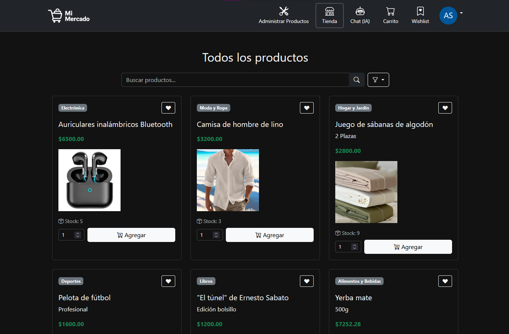
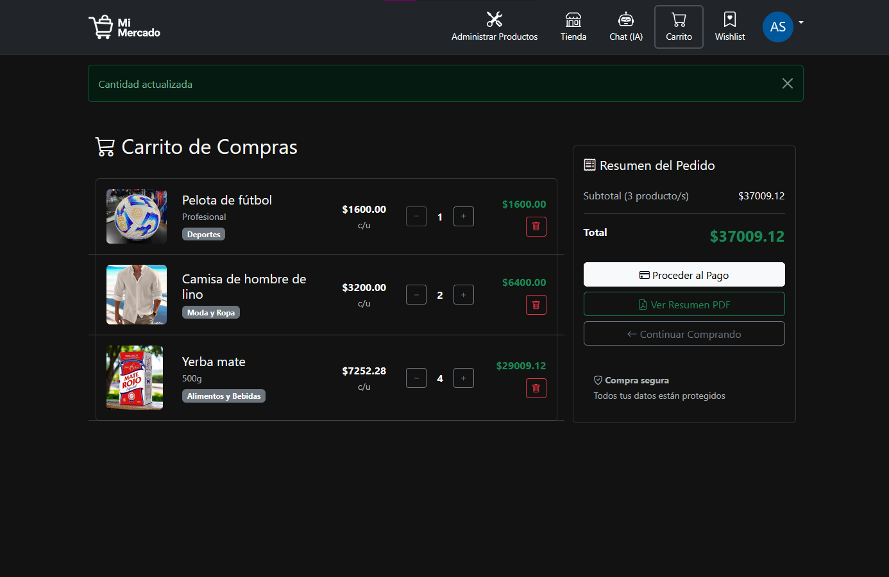

# Mi Mercado 🛒
Un marketplace moderno construido con Django integrado con un asistente de IA donde los usuarios pueden comprar y vender productos

### Funcionalidades centrales
- **Autenticación de usuario**
  - Registración y acceso con email y contraseña
  - Autenticación social (Google y GitHub) a través de django-allauth
  - Reinicio de contraseña
  - Perfiles de usuario con avatar y biografía

- **Manejo de Productos**
  - Crear, editar y borrar productos
  - Categorías de productos y filtros de búsqueda
  - Separación de productos en la tienda y los creados por el usuario 
  - Validación automática para imágenes
  - Manejo de stock
  - Paginación para listas de productos

- **Experiencia de Usuario**
  - Sistema de favoritos
  - Ajustes de cantidad dinámicos
  - Generación de recibo en formato PDF
  - Validación de Stock
  - Inegración de checkout con Mercado Pago

- **Chatbot de Inteligencia Artificial**
  - Asistente de IA de Gemini integrado
  - Manejo del historial
  - Respuestas contextuales sobre productos y el marketplace

- **Perfiles de Usuarios**
  - Customizables con avatars
  - Estadísticas de usuario (productos, favoritos, miembro desde)
  - Productos recientes

### Funcionalidades Técnicas
- Diseño responsivo utilizando Boostrap 5
- Actualización de lista de deseos en tiempo real sin necesidad de recargar la página
- Subida de imágenes con validación de tamaño
- Carrito de compras persistente
- Creación automática de perfil con Django signals
- Generación de PDF con ReportLab
- Arquitectura modular

### Funcionalidades de Seguridad
- Protección CSRF en todos los formularios
- Autenticación de usuario requerida para operaciones sensibles
- Validación de imagenes (tamaño y formato)
- Protección contra inyección SQL (Django ORM)
- Protección XSS (Django templates)

## Cómo inicializar Mi Mercado

### Prerequisitos
- Python (3.8+)
- pip
- virtualenv (recomendado)

### Instalación

1. **Clonar el Repositorio**
```bash
git clone https://github.com/Juk-Juk/prog4_grupo14.git
cd myproject
```

2. **Crear y activar el entorno virtual**
En Linux:
```bash
python -m venv venv
source  cd ../venv/bin/activate
```
En Windows:
```bash
python -m venv venv
source '..\venv\Scripts\activate'
```


3. **Instalar dependencias**
```bash
pip install -r requirements.txt
```

4. **Configurar variables de entorno**
Crear un archivo `.env` en el root del proyecto. Guíate utilizando el archivo `envExample.txt` como ejemplo

5. **Hacer migraciones**
```bash
python manage.py makemigrations
python manage.py migrate
```

6. **Crear superuser**
```bash
python manage.py createsuperuser
```

7. **Servir los archivos estáticos**
```bash
python manage.py collectstatic
```

8. **Ejecutar el servidor de desarrollo**
```bash
python manage.py runserver localhost:8000
```

Visita `http://localhost:8000` en tu explorador.

## Estructura del projecto
```
myproject/
├── core/
│   ├── migrations/
│   ├── templates/
│   │   ├── modals/
│   │   │  ├── login.html
│   │   │  ├── password_reset.html
│   │   │  └── signup.html
│   │   ├── base.html
│   │   ├── home.html
│   │   └── public_navbar.html
│   ├── __init__.py
│   ├── admin.py
│   ├── apps.py
│   ├── models.py
│   ├── tests.py
│   ├── urls.py
│   └── views.py
├── market/
│   ├── migrations/
│   ├── templates/
│   │   ├── my_product_list.html
│   │   ├── product_confirm_delete.html
│   │   ├── product_form.html
│   │   ├── product_list.html
│   │   ├── shopping_cart.html
│   │   └── wishlist.html
│   ├── __init__.py
│   ├── admin.py
│   ├── apps.py
│   ├── forms.py
│   ├── models.py
│   ├── tests.py
│   ├── urls.py
│   └── views.py
├── market_ai/
│   ├── migrations/
│   ├── templates/
│   │   ├── ai_chat.html
│   │   ├── price_suggest.html
│   │   └── recommendations.html
│   ├── __init__.py
│   ├── admin.py
│   ├── apps.py
│   ├── forms.py
│   ├── gemini_client.py
│   ├── models.py
│   ├── signals.py
│   ├── tests.py
│   ├── urls.py
│   └── views.py
├── media/
├── myproject/
│   ├── __init__.py
│   ├── asgi.py
│   ├── settings.py
│   ├── urls.py
│   └── wsgi.py
├── profiles/
│   ├── migrations/
│   ├── templates/
│   │   ├── profile_edit.html
│   │   └── profile.html
│   ├── __init__.py
│   ├── admin.py
│   ├── apps.py
│   ├── forms.py
│   ├── models.py
│   ├── signals.py
│   ├── tests.py
│   ├── urls.py
│   └── views.py
├── receipts/
│   ├── migrations/
│   ├── __init__.py
│   ├── admin.py
│   ├── apps.py
│   ├── models.py
│   ├── tests.py
│   ├── urls.py
│   ├── utils.py
│   └── views.py
├── static/
│   ├── css/
│   ├── images/
│   └── js/
├── templates/
│   └── registration/
│       └── password_reset_email.html
├── manage.py
└── requirements.txt
```

## Tecnologías utilizadas

### Backend
- **Django 5.2.5** - Framework
- **Python 3.x** - Lenguaje de Pragramación
- **SQLite** - Base de datos
- **ReportLab** - Generador de PDF
- **Pillow** - Procesador de imágenes

### Frontend
- **Bootstrap 5** - Framework de CSS
- **Bootstrap Icons** - Librería de íconos
- **Vanilla JavaScript** - Interactivos
- **AJAX/Fetch API** - Actualizaciones Asíncronas

### Autenticación
- **django-allauth** - Autenticación social
- **Google OAuth 2.0** - Acceso desde Google
- **GitHub OAuth** - Acceso desde GitHub

## API Endpoints

### Página principal
- `/` - Login, reinicio de contraseña, signup y logout manejados a través de modals en la página principal

### URLs de Market
- `products/` - Lista de productos general
- `products/my_products` - Lista de productos del usuario
- `products/ create/` - Crear producto
- `products/<id>/edit/` - Editar producto
- `products/<id>/delete/` - Borrar producto
- `products/cart/` - Carrito de compras
- `products/cart/add/<id>/` - Agregar al carrito
- `products/cart/remove/<id>/` - Quitar del carrito
- `products/cart/update/<id>/` - Actualizar cantidad del carrito
- `products/wishlist/` - Ver lista de deseos (Wishlist)
- `products/<id>/wishlist/` - Agregar/Quitar de la lista de deseos
- `products/cart/checkout/` - Pasar al area de pago (POST requerido)
- `products/cart/download/` - Descargar resumen PDF

### URLs de Perfil
- `profiles/edit/` - Editar perfil
- `profiles/view_profile/` - Ver perfil

### URLs de IA
- `chat/` - Chat con la IA

## Autores

- **Yo c:** -  [Juk-Juk](https://github.com/Juk-Juk)

## Capturas

### Página Principal


### Listado de Productos


### Carrito de Compras


---

Hecho con ❤️